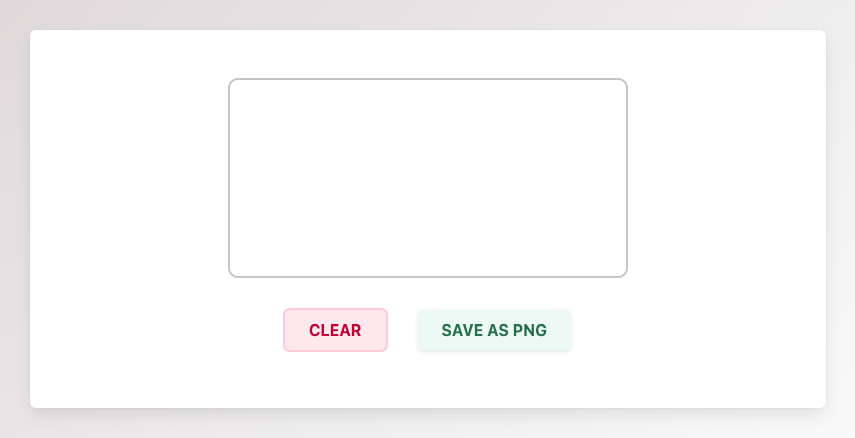

## Online Signature Converter

This project is a simple web application that allows users to create and save their signatures as PNG images. It utilizes HTML, CSS, and JavaScript along with the Signature Pad library for capturing signatures.

### Features
- **Signature Pad:** Users can draw their signatures using a canvas element.
- **Clear Button:** Allows users to clear their signatures if they want to start over.
- **Save Button:** Saves the signature as a PNG image file.
- **Responsive Design:** The application is designed to work on various screen sizes.

### Technologies Used
- HTML
- CSS (Bulma framework)
- JavaScript
- Signature Pad library

### Getting Started
To use this project locally, follow these steps:
1. Clone this repository to your local machine:
   ```bash
   git clone https://github.com/shantanum28/online-signature-converter.git
   ```
2. Navigate to the project directory:
   ```bash
   cd online-signature-converter
   ```
3. Start the Python HTTP server:
   ```bash
   python -m http.server 8000
   ```
4. Open your web browser and go to `http://localhost:8000` to access the project.

### Usage
1. Draw your signature using the cursor on the canvas area.
2. Click the "Clear" button if you want to redo your signature.
3. Click the "Save as PNG" button to download your signature as a PNG image.

### File Structure
- `index.html`: The main HTML file containing the structure of the web application.
- `styles.css`: Contains custom CSS styles for the application.
- `script.js`: Contains JavaScript code for handling signature functionality.

### Screenshots



### Contributing
Contributions are welcome! If you have any ideas for improvements or new features, feel free to submit a pull request.

### License
This project is licensed under the [MIT License](LICENSE).

### Acknowledgments
- Signature Pad library for providing the signature functionality.
- Bulma framework for CSS styling.

---
Copyright © 2024 [Shantanu Meshram]
